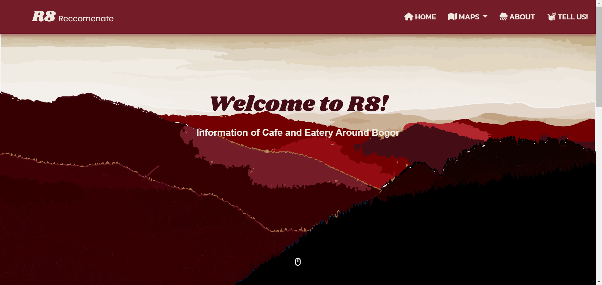
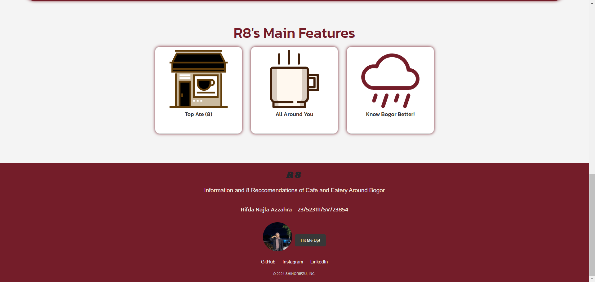
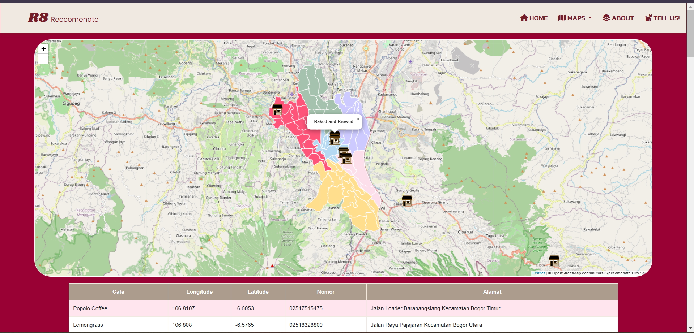
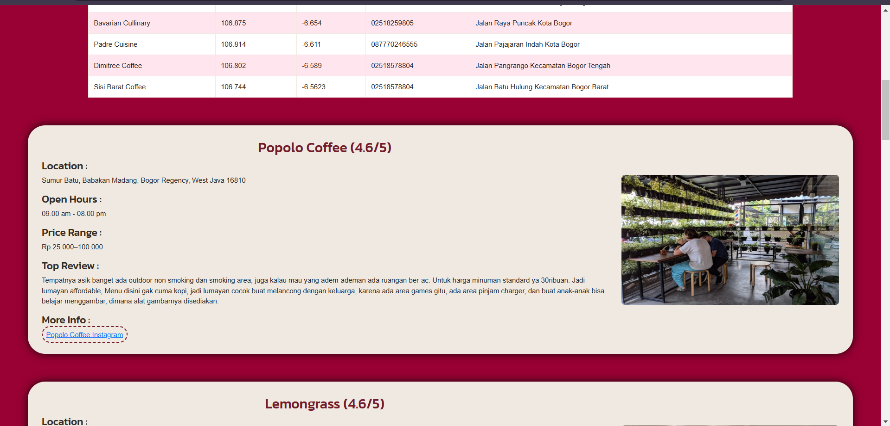
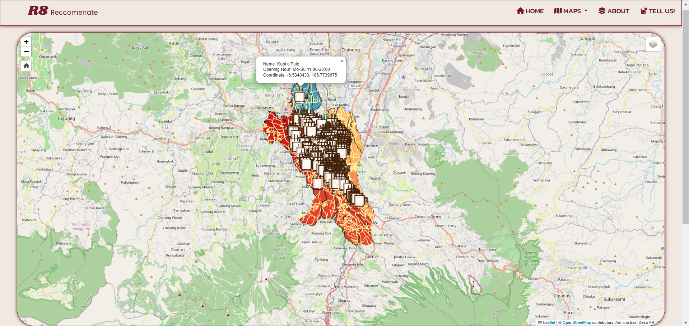
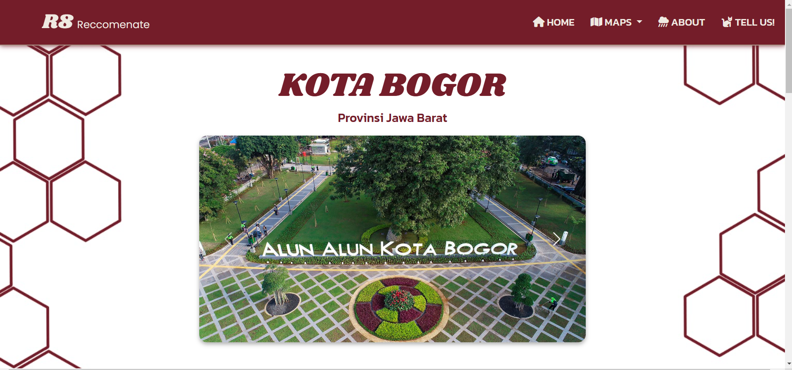
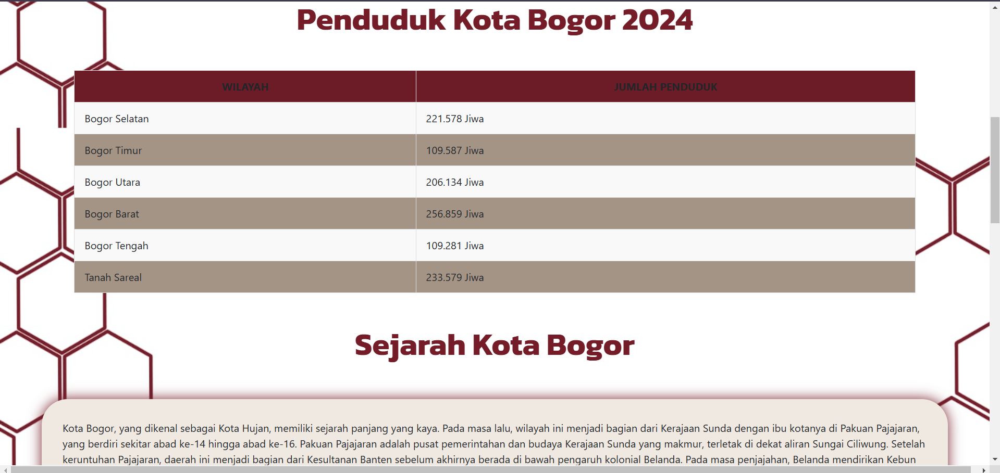
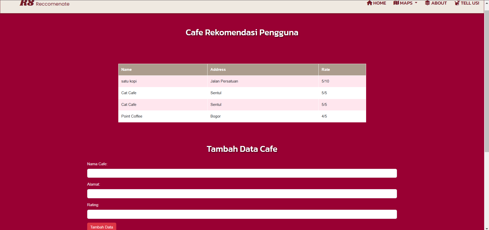

**RESPONSI PGWEB RIFDA NAJLA AZZAHRA**

**Produk :**

**R8 (RECCOMENATE) : 8 RECCOMENDATIONS OF CAFE AND EATERY AROUND BOGOR**

Kota Bogor sebagai salah satu kota yang sangat digemari wisatawan karena udara yang sejuk dan pemandangan alamnya yang indah, wisatawan juga tentunya akan sembari mencari cafe atau tempat makan yang menarik saat mengunjungi Kota Bogor. Selain itu, Cafe menjadi salah satu pilihan bagi mahasiswa yang dijadikan tempat yang nyaman untuk belajar dan mengerjakan tugas. Namun, situs web yang menyediakan informasi lengkap mengenai cafe tersebut masih terbatas.

---

## Deskripsi Produk
Website berbasiskan GIS "Reccomenate" merupakan situs web yang menyediakan informasi (sebaran dan rekomendasi) tempat makan dan cafe di kota bogor dengan menampilkan review serta peta interaktif dengan informasi pelengkap dari tempat tersebut dengan tujuan memudahkan wisatawan yang ingin mencari tempat makan menarik atau pun mahasiswa yang ingin mencari spot untuk nugas.

Beberapa Tujuan Pembuatan Produk adalah :

1. Mempermudah pencarian cafe bagi wisatawan dan mahasiswa
2. Menyajikan informasi yang mudah diakses dan interaktif
3. Memberikan rekomendasi dan informasi sebaran seluruh cafe di Kota Bogor

Aplikasi ini cocok untuk mahasiswa dan penduduk setempat, atau pun wisatawan.

---

## Komponen Pembangun Produk

1. **Frontend:**
   - CSS : Untuk tampilan UI Sederhana
   - SCSS : Untuk tampilan UI yang lebih kompleks (pembuatan parallax scrolling)
   - LeafletJS : Library untuk tampilan peta interaktif
   - FontAwesome : Icon

2. **Backend:**
   - Framework: Bootstrap
   - Database: MySQL (PhpMyAdmin)
   - HTML : Struktur Utama Isi Website
   - PHP : Struktur halaman database pada website
   - Javascript : Inisialisasi Peta Interaktif dan Animasi Parallax
   - GeoJSON : File untuk menampilkan data titik

3. **Integrasi Lain:**
   - API: GoogleFonts API (Fonts)
   - API: Google Collaboratory (Data Keseluruhan)
   - Server: GeoServer

---

## Sumber Data

- Data titik AllMaps.html : Scraping Google Collaboratory
- Data titik rekomendasi dan review : https://pergikuliner.com/
- Data jumlah penduduk : https://bogorkota.bps.go.id
- Data Area : https://www.indonesia-geospasial.com/2020/01/shp-rbi-provinsi-jawa-barat-perwilayah.html?m=1
- Informasi Umum Kota Bogor : https://id.m.wikipedia.org/wiki/Kota_Bogor

---

## Tangkapan Layar Komponen Penting Produk

1. **Halaman Utama (Index.html):**
   Menyediakan Menu Utama, footer, dan Home Hero
   
   
   

2. **Map dan List rekomendasi (Index.php):**
   Peta Interaktif dan scroll card informasi cafe rekomendasi
   
   
   

3. **Map Seluruh Cafe di Kota Bogor (Allmaps.html):**
   Menampilkan informasi lengkap mengenai keseluruhan cafe yang ada di Kota Bogor.
   
   

4. **Informasi Kota Bogor (top.html):**
   Halaman untuk mengenal sejarah, letak geografis, serta demografis Kota Bogor secara umum.
   
   
   

5. **Tambah Rekomendasi dan Review (more.php):**
   Halaman untuk melakukan review serta rekomendasi cafe baru dan tersimpan pada halaman web.
   
   

